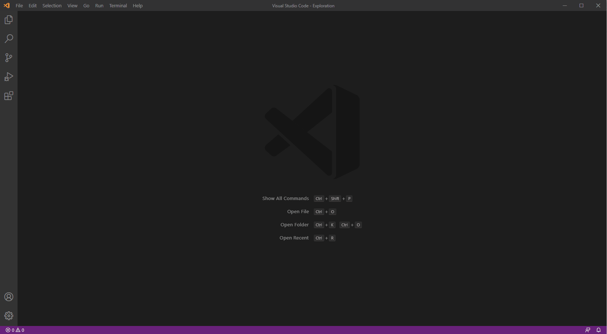

# IIS Express for VSCode
This extension gives you the power to run a folder open in Visual Studio Code as a website using an IIS Express web server.

[](https://marketplace.visualstudio.com/items?itemName=warren-buckley.iis-express)
[](https://marketplace.visualstudio.com/items?itemName=warren-buckley.iis-express)
[](https://marketplace.visualstudio.com/items?itemName=warren-buckley.iis-express)
[](https://marketplace.visualstudio.com/items?itemName=warren-buckley.iis-express)

## Sponsorware
<a href="https://github.com/sponsors/warrenbuckley"></a>
This is a **free extension** I have made for VSCode, if you find it useful to yourself or your business then <a href="https://github.com/sponsors/warrenbuckley">I would love you to consider sponsoring me on Github</a> please

## Features
* Auto opens folder in browser
* Super simple way from the command pallete to start & stop the website
* See ouput from the IIS Express command line directly in Visual Studio
* Support for PHP via `ApplicationHost.config` common changes for all sites running with IIS Express

### Requirements
* Windows Machine (Sorry not for Linux, OSX or Web)

## How do I Install IIS Express for VSCode?
Open the command pallete in VSCode & type **ext install** then search for **IIS Express** alternatively you can [download the IIS Express for VSCode extension on the marketplace](https://marketplace.visualstudio.com/items?itemName=warren-buckley.iis-expres)



## Settings for IIS Express
IIS Express for VSCode automatically generates a default config file for you & stores it at `.vscode/iisexpress.json`
You can modify this file on disk inside VSCode to get intellisens/autocompletion for the available properties for you to set

Setting | Alias | Description|Required
--------|-------|------------|--------
Port Number|port|The port number you wish to use for IIS Express|✔
Folder Path of Site|path|This property is optional & allows you to set an absolute path to the folder or subfolder as the root of your site/project for IIS Express to run. Additionally this support relative paths to the workspace folder such as `./my-sub-folder`|❌
CLR|clr|This property is optional & allows you to set AppPool CLR version, 2.0 vs 4.0|❌
Protocol|protocol|This property is optional & allows you to set http or https|❌
Url Suffix|url|This property is optional & allows you to set the page URL you wish to open eg: '/about/the-team'|❌

### Default Settings
By default with the file not generated it will create the following file for you on disk and setting a random port number.
```json
{
  "port": 18420,
  "path": "./",
  "clr": "v4.0",
  "protocol": "http"
}
```

## Global Settings for IIS Express for VSCode
Below is a table of settings that can be used to configure IIS Express for VSCode. You can easily get to these settings by using the settings (cog) icon in the IIS Express pane found by default under the file explorer.

Setting | Alias | Description | Default Value
--------|-------|-------------|------
Path to IISExpress.exe|iisexpress.iisExpressPath|An absolute path to **IISExpress.exe** such as `C:\Program Files\IIS Express\iisexpress.exe`|null - We try to use default program path location
Path to AppCmd.exe|iisexpress.appcmdPath|An absolute path to **appcmd.exe** such as `C:\Program Files\IIS Express\appcmd.exe`|null - We try to use default program path location
Auto launch browser|iisexpress.autoLaunchBrowser|An option to disable or enable the browser from launching the site when IIS Express starts. By default this is **true**|true
Open in browser|iisexpress.autoLaunchBrowser|Decide which browser to auto launch the site with when `iisexpress.autoLaunchBrowser` is set to **true**|default (default, chrome, msedge, firefox, opera)

## Available commands
* **Start Website** - Start the current folder run as a website
* **Stop Website** - Stop the current folder run as a website
* **Restart Website** - Restart (Stop & Start) the current folder run as a website
* **Become a supporter** - Opens a webpage to my GitHub Sponsor page if you wish to donate & become a sponsor
* **Open Settings** - This directly opens VSCode settings for IIS Express


## How do I use the extension?
The VSCode command pallete is your friend. Press **F1 on the keyboard and start typing IISExpress** to see the list of commands to use.
Alternatively is version 1.2.0 and newer there is a new panel view that by default lives under the list of files in the file explorer, in newer versions of VSCode you are able to drag and drop this pane around to a new location if you prefer to put it elsewhere.

## How do I use HTTPS for my site?
To enable HTTPS for your site use the settings file `.vscode/iisexpress.json` set the property **protocol** to **https** and ensure the port property is in the range between `44300 - 44399`

## How do I change keymappings for IIS Express for VSCode
By default IIS Express for VSCode binds to the following keyboard shortcuts, you may prefer to change these keybindings if you find them conflicting in your workflows.
The best way to do this is to [read the official documentation from VSCode](https://code.visualstudio.com/docs/getstarted/keybindings).

Keyboard Shortcut|Command
-----------------|-------
ctrl+f5| Start Site
shift+f5| Stop Site
ctrl+shift+f5| Restart Site

